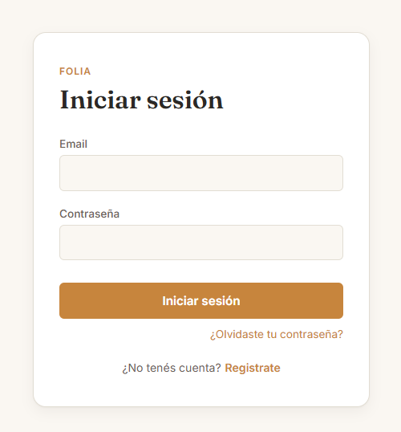
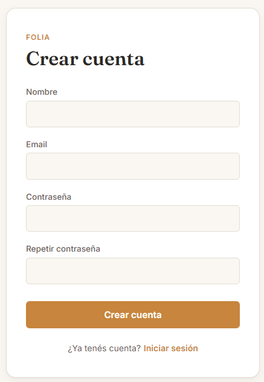
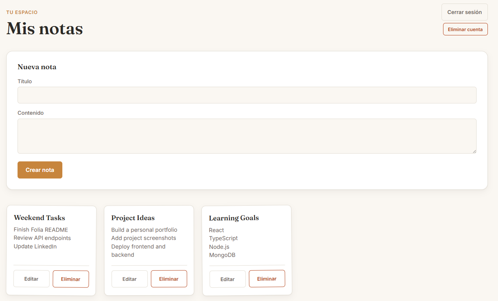
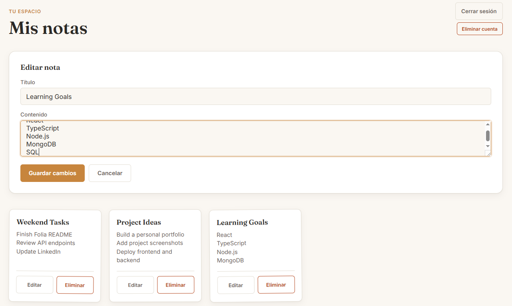
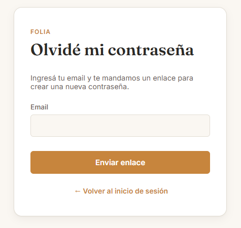

# Folia 📝

A full-stack notes application built with React and TypeScript.

Folia allows users to securely manage their personal notes. Each user has access only to their own notes and can create, edit, and delete them.

## 🌐 Live Demo

[Folia](https://folia-ten.vercel.app/)

You can register a new account and explore the application.

## ✨ Features

- User registration with email verification
- Secure user login
- Create, edit, and delete notes
- Users can only access their own notes
- Password recovery through email
- Account deletion
- Automatic deletion of all notes associated with the deleted account
- Responsive user interface

## 🛠️ Technologies

### Frontend

- React
- TypeScript
- Vite
- CSS
- React Router

### Backend

- Node.js
- Express.js
- MongoDB
- Mongoose
- JWT
- bcrypt
- Nodemailer

## 🏗️ Architecture

Folia is divided into two separate applications:

- **Frontend:** React + TypeScript
- **Backend:** Node.js + Express + MongoDB

The frontend communicates with the backend through a REST API.

### Related Repository

[Folia Backend](https://github.com/guidoese/folia_backend)

### Backend API

[Folia Backend API](https://folia-backend.vercel.app/)

## 🔐 Authentication & Security

The application implements an authentication system that includes:

- User registration
- Email account verification
- JWT-based authentication
- Password recovery through email
- Protected user resources
- Account deletion

Each user's notes are associated with their account, ensuring that users can only access their own data.

Passwords are securely hashed using bcrypt, while sensitive configuration values are managed through environment variables.

## 📸 Screenshots

### Login



### Register



### Notes Dashboard



### Edit Note



### Password Recovery



## 🚀 Getting Started

### Prerequisites

Make sure you have installed:

- Node.js
- npm

### Installation

Clone the repository:

```bash
git clone https://github.com/guidoese/folia.git

Navigate to the project directory:

cd folia

Install dependencies:

npm install

Start the development server:

npm run dev

The application will be available locally through the URL provided by Vite.

📚 About the Project

Folia was developed as a practical Full Stack Web Development project as part of my training in web development.

The project allowed me to practice building a complete web application, connecting a React frontend with a Node.js/Express REST API and a MongoDB database.

It also provided practical experience with authentication, protected resources, CRUD operations, email-based account verification, password recovery, and account management.

👨‍💻 Author

Guido Suarez

Junior Full Stack Web Developer

GitHub
